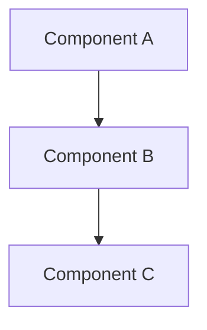

# Design Document

## Overview

[High-level description of the feature and its place in the overall system]

## Steering Document Alignment

### Technical Standards (tech.md)
[How the design follows documented technical patterns and standards]

### Project Structure (structure.md)
[How the implementation will follow project organization conventions]

## Code Reuse Analysis
[What existing code will be leveraged, extended, or integrated with this feature]

### Existing Components to Leverage
- **[Component/Utility Name]**: [How it will be used]
- **[Service/Helper Name]**: [How it will be extended]

### Integration Points
- **[Existing System/API]**: [How the new feature will integrate]
- **[Database/Storage]**: [How data will connect to existing schemas]

## Architecture

[Describe the overall architecture and design patterns used]



## Components and Interfaces

### Component 1
- **Purpose:** [What this component does]
- **Interfaces:** [Public methods/APIs]
- **Dependencies:** [What it depends on]
- **Reuses:** [Existing components/utilities it builds upon]

### Component 2
- **Purpose:** [What this component does]
- **Interfaces:** [Public methods/APIs]
- **Dependencies:** [What it depends on]
- **Reuses:** [Existing components/utilities it builds upon]

## Data Models

### Model 1
```
[Define the structure of Model1 in your language]
- id: [unique identifier type]
- name: [string/text type]
- [Additional properties as needed]
```

### Model 2
```
[Define the structure of Model2 in your language]
- id: [unique identifier type]
- [Additional properties as needed]
```

## Error Handling

### Error Scenarios
1. **Scenario 1:** [Description]
   - **Handling:** [How to handle]
   - **User Impact:** [What user sees]

2. **Scenario 2:** [Description]
   - **Handling:** [How to handle]
   - **User Impact:** [What user sees]

## Testing Strategy

### Unit Testing
- [Unit testing approach]
- [Key components to test]

### Integration Testing
- [Integration testing approach]
- [Key flows to test]

### End-to-End Testing
- [E2E testing approach]
- [User scenarios to test]
