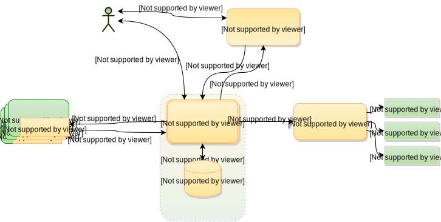

<h1 align="center" style="border-bottom: none">
    <a href="https://prometheus.io" target="_blank"></a><br>Prometheus
</h1>

<p align="center">Visit <a href="https://prometheus.io" target="_blank">prometheus.io</a> for the full documentation,
examples and guides.</p>

<div align="center">

[](https://github.com/prometheus/prometheus/actions/workflows/ci.yml)
[][quay]
[][hub]
[](https://goreportcard.com/report/github.com/prometheus/prometheus)
[](https://bestpractices.coreinfrastructure.org/projects/486)
[](https://securityscorecards.dev/viewer/?uri=github.com/prometheus/prometheus)
[](https://clomonitor.io/projects/cncf/prometheus)
[](https://gitpod.io/#https://github.com/prometheus/prometheus)
[](https://bugs.chromium.org/p/oss-fuzz/issues/list?sort=-opened&can=1&q=proj:prometheus)

</div>

Prometheus, a [Cloud Native Computing Foundation](https://cncf.io/) project, is a systems and service monitoring system. It collects metrics
from configured targets at given intervals, evaluates rule expressions,
displays the results, and can trigger alerts when specified conditions are observed.

The features that distinguish Prometheus from other metrics and monitoring systems are:

* A **multi-dimensional** data model (time series defined by metric name and set of key/value dimensions)
* PromQL, a **powerful and flexible query language** to leverage this dimensionality
* No dependency on distributed storage; **single server nodes are autonomous**
* An HTTP **pull model** for time series collection
* **Pushing time series** is supported via an intermediary gateway for batch jobs
* Targets are discovered via **service discovery** or **static configuration**
* Multiple modes of **graphing and dashboarding support**
* Support for hierarchical and horizontal **federation**

## Architecture overview



## Install

There are various ways of installing Prometheus.

### Precompiled binaries

Precompiled binaries for released versions are available in the
[*download* section](https://prometheus.io/download/)
on [prometheus.io](https://prometheus.io). Using the latest production release binary
is the recommended way of installing Prometheus.
See the [Installing](https://prometheus.io/docs/introduction/install/)
chapter in the documentation for all the details.

### Docker images

Docker images are available on [Quay.io](https://quay.io/repository/prometheus/prometheus) or [Docker Hub](https://hub.docker.com/r/prom/prometheus/).

You can launch a Prometheus container for trying it out with

```bash
docker run --name prometheus -d -p 127.0.0.1:9090:9090 prom/prometheus
```

Prometheus will now be reachable at <http://localhost:9090/>.

### Building from source

To build Prometheus from source code, You need:

* Go: Version specified in [go.mod](./go.mod) or greater.
* NodeJS: Version specified in [.nvmrc](./web/ui/.nvmrc) or greater.
* npm: Version 10 or greater (check with `npm --version` and [here](https://www.npmjs.com/)).

Start by cloning the repository:

```bash
git clone https://github.com/prometheus/prometheus.git
cd prometheus
```

You can use the `go` tool to build and install the `prometheus`
and `promtool` binaries into your `GOPATH`:

```bash
go install github.com/prometheus/prometheus/cmd/...
prometheus --config.file=your_config.yml
```

*However*, when using `go install` to build Prometheus, Prometheus will expect to be able to
read its web assets from local filesystem directories under `web/ui/static`. In order for
these assets to be found, you will have to run Prometheus from the root of the cloned
repository. Note also that this directory does not include the React UI unless it has been
built explicitly using `make assets` or `make build`.

An example of the above configuration file can be found [here.](https://github.com/prometheus/prometheus/blob/main/documentation/examples/prometheus.yml)

You can also build using `make build`, which will compile in the web assets so that
Prometheus can be run from anywhere:

```bash
make build
./prometheus --config.file=your_config.yml
```

The Makefile provides several targets:

* *build*: build the `prometheus` and `promtool` binaries (includes building and compiling in web assets)
* *test*: run the tests
* *test-short*: run the short tests
* *format*: format the source code
* *vet*: check the source code for common errors
* *assets*: build the React UI

### Service discovery plugins

Prometheus is bundled with many service discovery plugins. You can customize
which service discoveries are included in your build using Go build tags.

To exclude service discoveries when building with `make build`, add the desired
tags to the `.promu.yml` file under `build.tags.all`:

```yaml
build:
    tags:
        all:
            - netgo
            - builtinassets
            - remove_all_sd           # Exclude all optional SDs
            - enable_kubernetes_sd    # Re-enable only kubernetes
```

Then run `make build` as usual. Alternatively, when using `go build` directly:

```bash
go build -tags "remove_all_sd,enable_kubernetes_sd" ./cmd/prometheus
```

Available build tags:
* `remove_all_sd` - Exclude all optional service discoveries (keeps file_sd, static_sd, and http_sd)
* `enable_<name>_sd` - Re-enable a specific SD when using `remove_all_sd`

If you add out-of-tree plugins, which we do not endorse at the moment,
additional steps might be needed to adjust the `go.mod` and `go.sum` files. As
always, be extra careful when loading third party code.

### Building the Docker image

You can build a docker image locally with the following commands:

```bash
make promu
promu crossbuild -p linux/amd64
make npm_licenses
make common-docker-amd64
```

The `make docker` target is intended only for use in our CI system and will not
produce a fully working image when run locally.

## Using Prometheus as a Go Library

Within the Prometheus project, repositories such as [prometheus/common](https://github.com/prometheus/common) and
[prometheus/client-golang](https://github.com/prometheus/client-golang) are designed as re-usable libraries.

The [prometheus/prometheus](https://github.com/prometheus/prometheus) repository builds a stand-alone program and is not
designed for use as a library. We are aware that people do use parts as such,
and we do not put any deliberate inconvenience in the way, but we want you to be
aware that no care has been taken to make it work well as a library. For instance,
you may encounter errors that only surface when used as a library.

### Remote Write

We are publishing our Remote Write protobuf independently at
[buf.build](https://buf.build/prometheus/prometheus/assets).

You can use that as a library:

```shell
go get buf.build/gen/go/prometheus/prometheus/protocolbuffers/go@latest
```

This is experimental.

### Prometheus code base

In order to comply with [go mod](https://go.dev/ref/mod#versions) rules,
Prometheus release number do not exactly match Go module releases.

For the
Prometheus v3.y.z releases, we are publishing equivalent v0.3y.z tags. The y in v0.3y.z is always padded to two digits, with a leading zero if needed.

Therefore, a user that would want to use Prometheus v3.0.0 as a library could do:

```shell
go get github.com/prometheus/prometheus@v0.300.0
```

For the
Prometheus v2.y.z releases, we published the equivalent v0.y.z tags.

Therefore, a user that would want to use Prometheus v2.35.0 as a library could do:

```shell
go get github.com/prometheus/prometheus@v0.35.0
```

This solution makes it clear that we might break our internal Go APIs between
minor user-facing releases, as [breaking changes are allowed in major version
zero](https://semver.org/#spec-item-4).

## React UI Development

For more information on building, running, and developing on the React-based UI, see the React app's [README.md](web/ui/README.md).

## More information

* Godoc documentation is available via [pkg.go.dev](https://pkg.go.dev/github.com/prometheus/prometheus). Due to peculiarities of Go Modules, v3.y.z will be displayed as v0.3y.z (the y in v0.3y.z is always padded to two digits, with a leading zero if needed), while v2.y.z will be displayed as v0.y.z.
* See the [Community page](https://prometheus.io/community) for how to reach the Prometheus developers and users on various communication channels.

## Contributing

Refer to [CONTRIBUTING.md](https://github.com/prometheus/prometheus/blob/main/CONTRIBUTING.md)

## License

Apache License 2.0, see [LICENSE](https://github.com/prometheus/prometheus/blob/main/LICENSE).

[hub]: https://hub.docker.com/r/prom/prometheus/
[quay]: https://quay.io/repository/prometheus/prometheus
