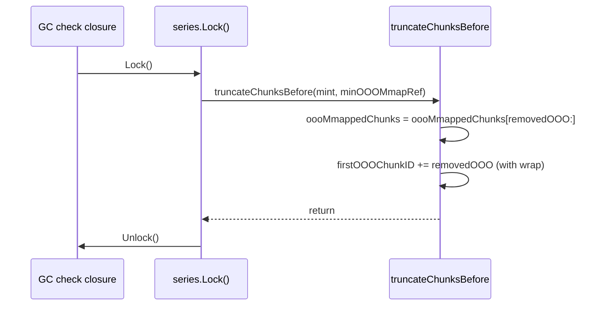
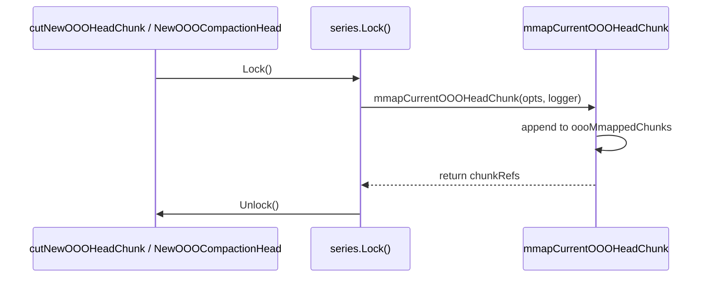
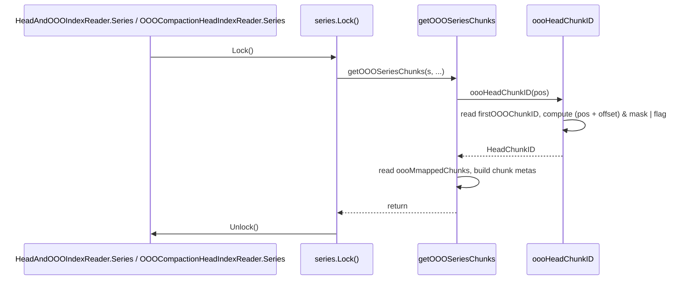
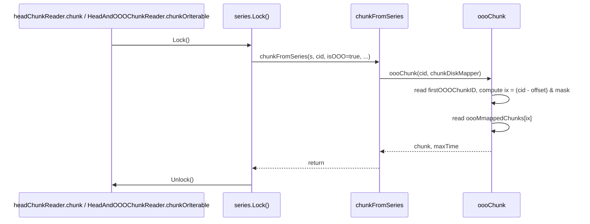
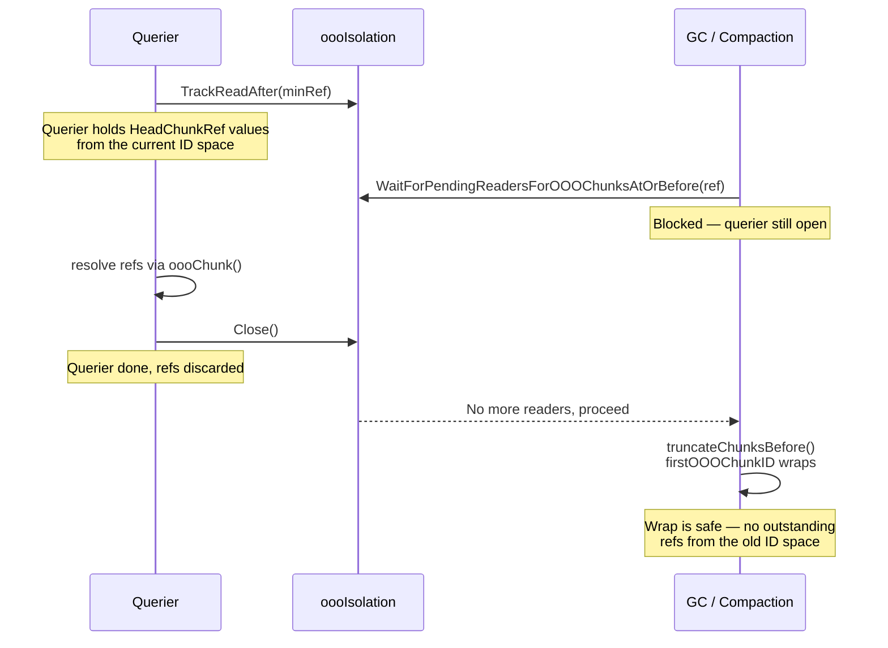
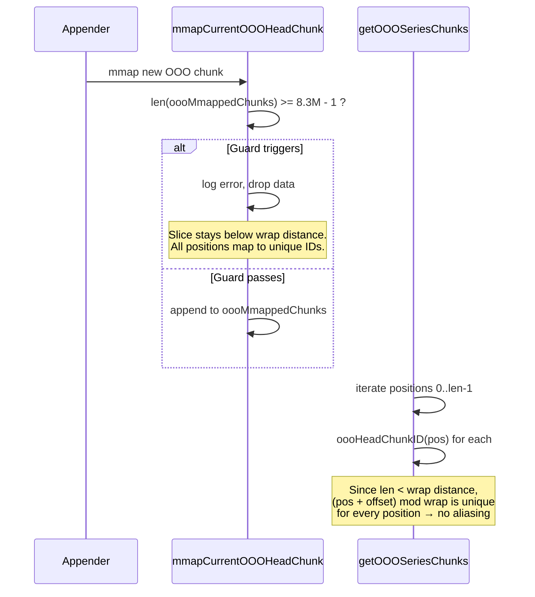

# Fix: OOO Chunk ID Overflow via Modular Arithmetic

## 1. The Problem

Prometheus TSDB packs a series reference and a chunk ID into a single 64-bit value (`HeadChunkRef`) to identify chunks during queries. The chunk ID portion is 24 bits wide. Out-of-order (OOO) chunks steal one of those bits as a flag to distinguish themselves from in-order chunks, leaving only 23 bits (~8.3 million IDs) for the actual chunk position.

Each series tracks a monotonically increasing counter (`firstOOOChunkID`) that maps chunk IDs back to slice indices. This counter grows every time OOO chunks are garbage collected, but it never resets for series that continuously receive OOO data. Once the counter exceeds 8.3 million, the constructed chunk ID overflows 24 bits and `NewHeadChunkRef` panics with `"chunk ID exceeds 3 bytes"`, crashing the query path.

This affects long-running ingester instances with series that sustain a high rate of out-of-order samples. The default OOO chunk capacity of 32 samples accelerates the problem because more chunks are created per sample count.

## 2. The Technical Plan

### How chunk IDs work today

`HeadChunkRef` is a 64-bit value split into two fields:

```
┌──────────────────────────────────────────┬──────────────────────────┐
│         HeadSeriesRef (40 bits)           │   HeadChunkID (24 bits)  │
└──────────────────────────────────────────┴──────────────────────────┘
```

The 24-bit `HeadChunkID` is further divided for OOO chunks:

```
┌─────────┬───────────────────────┐
│ bit 23  │     bits 0-22         │
│ OOO flag│   chunk position      │
│ (1=OOO) │   (23 bits, max 8.3M) │
└─────────┴───────────────────────┘
```

The chunk position is computed as `pos + firstOOOChunkID`, where `pos` is the index into the current `oooMmappedChunks` slice and `firstOOOChunkID` is incremented every time old chunks are truncated. This sliding window scheme lets the code map a globally unique chunk ID back to a slice index via `id - firstOOOChunkID`.

### Why it breaks

`firstOOOChunkID` grows without bound. Even though the slice stays small (old chunks are truncated), the offset accumulates past 2^23 over time. When `(pos + firstOOOChunkID) | oooChunkIDMask` exceeds 2^24, `NewHeadChunkRef` panics.

### The fix

Wrap `firstOOOChunkID` modulo `oooChunkIDMask` (2^23 = 8,388,608). Since the value is only ever used as a sliding window offset (`chunkID = pos + offset`, `pos = chunkID - offset`), wrapping is safe as long as the number of active OOO chunks is much smaller than the 8.3M wrap distance. An existing guard already enforces this invariant by capping the slice at `oooChunkIDMask - 1` entries.

Three locations change. The following example uses small numbers to illustrate how the modular wrap works across a GC truncation and subsequent queries. Assume the ID space wraps at 10 (in reality it wraps at 8.3M).

```
BEFORE TRUNCATION
─────────────────
  offset = 7                              (firstOOOChunkID)
  chunks = [c0, c1, c2, c3, c4]          (5 chunks, positions 0–4)

  Pack chunk ID for c2 (position 2):
    raw = (2 + 7) mod 10 = 9
    chunk ID = 9 + OOO flag               → querier holds this ref

GC TRUNCATION (removes c0, c1, c2)
──────────────────────────────────
  offset = (7 + 3) mod 10 = 0            ← wraps around to 0
  chunks = [c3, c4]                       (2 chunks remain, positions 0–1)

  Pack chunk ID for c3 (now position 0):
    raw = (0 + 0) mod 10 = 0
    chunk ID = 0 + OOO flag               → new ref after wrap

QUERY: resolve c3's ref (raw = 0)
─────────────────────────────────
  index = (0 - 0) mod 10 = 0
  chunks[0] = c3                          ✓ correct

QUERY: resolve stale ref for c2 (raw = 9, truncated)
────────────────────────────────────────────────────
  index = (9 - 0) mod 10 = 9
  9 >= len(chunks)                        → ErrNotFound ✓
```

### Locking invariant

The correctness of modular arithmetic depends on `firstOOOChunkID` and `oooMmappedChunks` being observed atomically: a reader must never see a state where one has been updated but the other has not. All code paths that read or write these fields hold the per-series mutex (`memSeries.Lock()`):

| Diagram | Role | Entry point | Fields accessed |
|---------|------|-------------|-----------------|
| Writer 1 | GC truncation | GC `check` closure → `truncateChunksBefore` | Truncates `oooMmappedChunks`, advances `firstOOOChunkID` (with wrap) |
| Writer 2 | Chunk mmap | `cutNewOOOHeadChunk` / `NewOOOCompactionHead` → `mmapCurrentOOOHeadChunk` | Appends to `oooMmappedChunks` |
| Reader 1 | Chunk ID packing | `Series()` → `getOOOSeriesChunks` → `oooHeadChunkID` | Reads `firstOOOChunkID` and `oooMmappedChunks` to build `HeadChunkRef` values |
| Reader 2 | Chunk resolution | `chunk()` / `chunkOrIterable()` → `chunkFromSeries` → `oooChunk` | Reads `firstOOOChunkID` and indexes `oooMmappedChunks` to resolve a `HeadChunkRef` |

**Writers** — mutate `firstOOOChunkID` and/or `oooMmappedChunks`:





**Readers** — read `firstOOOChunkID` and `oooMmappedChunks`:





This matters more with modular arithmetic than with the current linear arithmetic. Without wrapping, a torn read (stale `firstOOOChunkID` with updated `oooMmappedChunks`) would produce an out-of-range index caught by the bounds check. With wrapping, modular subtraction could map a stale offset to a small positive number that passes the bounds check, silently returning the wrong chunk. The series lock prevents this by ensuring both fields are always observed in a consistent state.

If a future change introduces a lock-free read path for OOO chunk data, the modular arithmetic would need to be revisited (e.g., using atomic snapshots of both fields together).

### Why the WBL is unaffected

`firstOOOChunkID` is purely in-memory state on `memSeriesOOOFields`. It is never persisted to the WAL, WBL, or chunk snapshots. The WBL stores three record types:

- `RefSample`: `HeadSeriesRef` + timestamp + value
- `RefHistogramSample`: `HeadSeriesRef` + timestamp + histogram
- `RefMmapMarker`: `HeadSeriesRef` + `ChunkDiskMapperRef`

None contain `HeadChunkID`. On restart, `resetSeriesWithMMappedChunks` creates a fresh `memSeriesOOOFields{oooMmappedChunks: oooMmc}` with `firstOOOChunkID = 0` (zero value). The OOO isolation mechanism also tracks reads by `ChunkDiskMapperRef`, not by `HeadChunkID`.

### Why stale references are safe

A querier created before a wrap holds `HeadChunkRef` values from the old ID space. When it resolves them via `oooChunk()` after `firstOOOChunkID` has wrapped, the modular subtraction recovers the correct slice index if the chunk still exists. If the chunk was truncated, the computed index falls outside the slice bounds and returns `ErrNotFound`, which is the existing behavior for stale references.

The only theoretical risk is aliasing: a stale reference accidentally mapping to a valid index for a *different* chunk after a wrap. Two mechanisms prevent this:

1. **OOO isolation prevents cross-wrap aliasing.** The `oooIsolationState` tracks active readers by `ChunkDiskMapperRef`. `truncateChunksBefore` (which advances `firstOOOChunkID`) cannot proceed while any querier holds references to chunks at or before the truncation point, because `WaitForPendingReadersForOOOChunksAtOrBefore` blocks until all such readers have closed. Since `HeadChunkRef` values are created and resolved within a single querier's lifetime (`getOOOSeriesChunks` → `oooChunk`), `firstOOOChunkID` cannot wrap past any outstanding reference. This is a formal guarantee, not a practical observation about querier lifetimes.



2. **The guard in `mmapCurrentOOOHeadChunk` prevents intra-call aliasing.** It caps the `oooMmappedChunks` slice at `oooChunkIDMask - 1` entries, ensuring that within a single `getOOOSeriesChunks` invocation all chunk positions produce unique IDs (because the slice length is always much smaller than the wrap distance).



### Why the chunk sort order is safe under wrapping

`getOOOSeriesChunks` sorts collected chunks via `lessByMinTimeAndMinRef`, which uses `Ref` (the packed `HeadChunkRef`) as a tiebreaker when `MinTime` is equal. After wrapping, a newer chunk can have a lower `Ref` than an older chunk, inverting the tiebreaker. This is safe for three reasons:

1. **Same-MinTime chunks always overlap, so `Ref` order never affects grouping.** The overlap detector emits a new group only when `c.MinTime > toBeMerged.MaxTime`. If two chunks share the same `MinTime`, then `b.MinTime <= a.MaxTime` is always true (since every chunk satisfies `MinTime <= MaxTime`), so they are always merged into the same `multiMeta` group. The `Ref` tiebreaker cannot change which chunks are grouped together or which are emitted standalone.

2. **Order within a `multiMeta` group is irrelevant.** Each sub-chunk in a `multiMeta` becomes an iterable fed into `ChainSampleIteratorFromIterables`, which creates a `chainSampleIterator`. This iterator uses a heap to merge samples by timestamp, producing correct output regardless of the input iterable order. The iterator's contract already documents non-deterministic selection among same-timestamp samples ("one sample from random overlapped ones is kept").

3. **The only observable effect is conservative.** The `chainSampleIterator` tracks whether adjacent samples come from the same base iterator (the `consecutive` flag). A different iterable order may cause more transitions between base iterators, setting `CounterResetHint` to `UnknownCounterReset` instead of preserving the original hint. This is the conservative (safe) direction and never produces an incorrect hint.

### Note on the in-order path

`firstChunkID` (in-order) has the same latent overflow bug with the full 24-bit space (~16M IDs). It is much harder to trigger (~16 years at 15s scrape interval per series, regardless of fleet size since each series has its own counter) and has never been observed. It should be tracked as a separate issue, not bundled into this fix, to keep the change small and focused.

Applying the same modular wrap to the in-order path is not straightforward. Unlike OOO chunks (flat slice indexed by position), in-order chunks use a linked list (`memChunk.next`). The `chunk()` method computes `offset := int(cid) - int(s.firstChunkID)` and walks the linked list by that offset. Modular arithmetic would need to handle the linked-list traversal correctly, making it a more involved change than the OOO fix.

## 4. Detailed Implementation

### Files changed

All changes are in the `tsdb` package under `github.com/prometheus/prometheus`. Three files are modified.

#### File 1: `tsdb/head_read.go`

**Change A: `oooHeadChunkID`**

Current:
```go
func (s *memSeries) oooHeadChunkID(pos int) chunks.HeadChunkID {
    return (chunks.HeadChunkID(pos) + s.ooo.firstOOOChunkID) | oooChunkIDMask
}
```

Changed to:
```go
func (s *memSeries) oooHeadChunkID(pos int) chunks.HeadChunkID {
    return ((chunks.HeadChunkID(pos) + s.ooo.firstOOOChunkID) & (oooChunkIDMask - 1)) | oooChunkIDMask
}
```

Rationale: The bitmask `& (oooChunkIDMask - 1)` constrains the position to 23 bits before the OOO flag is OR'd in. This is preferred over `% oooChunkIDMask` for consistency with `unpackHeadChunkRef`, which already uses `cid & (oooChunkIDMask - 1)` to extract the position. Since `oooChunkIDMask` is a power of 2, the two operations are equivalent. The outer parentheses around the `&` expression are added for clarity: Go's operator precedence already evaluates `&` before `|`, but explicit grouping avoids ambiguity for reviewers accustomed to C-family precedence rules.

The comment should be updated to document the wrapping behavior and the invariant that the number of active OOO chunks must be much smaller than `oooChunkIDMask` for correctness.

**Change B: `oooChunk`**

Current:
```go
ix := int(id) - int(s.ooo.firstOOOChunkID)
```

Changed to:
```go
ix := int((id - s.ooo.firstOOOChunkID) & (oooChunkIDMask - 1))
```

Rationale: Both `id` and `firstOOOChunkID` are `HeadChunkID` (uint64). The subtraction is unsigned, so if `id < firstOOOChunkID` (the wrap case), the result wraps around in uint64 space. The bitmask then extracts only the lower 23 bits, recovering the correct slice index.

Worked example — normal case (`id >= firstOOOChunkID`):
```
firstOOOChunkID = 5, id = 8
id - firstOOOChunkID = 3
3 & 0x7FFFFF = 3   → ix = 3 (correct slice index)
```

Worked example — wrap case (`id < firstOOOChunkID`):
```
firstOOOChunkID = 5, id = 3  (chunk was created when firstOOOChunkID was near the wrap boundary)
id - firstOOOChunkID = 3 - 5 = 0xFFFF_FFFF_FFFF_FFFE  (uint64 underflow)
0xFFFF_FFFF_FFFF_FFFE & 0x7FFFFF = 0x7FFFFE = 8,388,606
8,388,606 >= len(oooMmappedChunks)  → returns ErrNotFound (chunk was truncated)
```

Worked example — wrap case, chunk still alive:
```
firstOOOChunkID was 0x7FFFFD, series had 5 chunks at positions 0-4
oooHeadChunkID(2) = (2 + 0x7FFFFD) & 0x7FFFFF | 0x800000
                  = 0x7FFFFF & 0x7FFFFF | 0x800000
                  = 0xFFFFFF
unpackHeadChunkRef extracts: id = 0xFFFFFF & 0x7FFFFF = 0x7FFFFF

Later, 3 chunks truncated: firstOOOChunkID = (0x7FFFFD + 3) & 0x7FFFFF = 0
Chunks at positions 3-4 survive, renumbered to positions 0-1.
Old position 2 was truncated, but suppose position 3 survived — its old id was:
oooHeadChunkID(3) = (3 + 0x7FFFFD) & 0x7FFFFF | 0x800000 = 0 | 0x800000 = 0x800000
unpackHeadChunkRef extracts: id = 0

Resolve: ix = int((0 - 0) & 0x7FFFFF) = 0 → oooMmappedChunks[0] ✓ (correct, this is the surviving chunk)
```

This replaces the `if ix < 0 { ix += oooChunkIDMask }` approach from an earlier draft. The bitmask form is cleaner because:
1. It avoids the signed/unsigned conversion dance
2. It produces correct results in a single expression
3. It mirrors how `unpackHeadChunkRef` works

The existing bounds check (`ix < 0 || ix >= len(s.ooo.oooMmappedChunks)`) should be simplified to `ix >= len(s.ooo.oooMmappedChunks)` since the result of the bitmask operation is always non-negative. Keeping the dead `ix < 0` check is acceptable but unnecessary.

#### File 2: `tsdb/head.go`

**Change C: `truncateChunksBefore`**

Current:
```go
s.ooo.firstOOOChunkID += chunks.HeadChunkID(removedOOO)
```

Changed to:
```go
s.ooo.firstOOOChunkID = (s.ooo.firstOOOChunkID + chunks.HeadChunkID(removedOOO)) & (oooChunkIDMask - 1)
```

Rationale: This is where the wrapping is actually applied. The bitmask keeps `firstOOOChunkID` within [0, oooChunkIDMask - 1], ensuring it stays synchronized with the modular space used by `oooHeadChunkID` and `oooChunk`.

#### File 3: `tsdb/head_append.go`

**No code changes required.**

The existing guard in `mmapCurrentOOOHeadChunk`:
```go
if len(s.ooo.oooMmappedChunks) >= (oooChunkIDMask - 1) {
    logger.Error("Too many OOO chunks, dropping data", "series", s.lset.String())
    break
}
```

This guard remains correct. With wrapping, its purpose shifts from "prevent ID overflow" to "prevent intra-call ID aliasing" (ensure that within a single `getOOOSeriesChunks` invocation all chunk positions produce unique IDs). The bound is the same. The comment and log message should be updated to reflect the new rationale.

### Files NOT changed

- `tsdb/chunks/chunks.go`: The `NewHeadChunkRef` panic is retained as a defense-in-depth check. With the fix, it should never trigger for OOO chunks. Since `firstOOOChunkID` and `oooHeadChunkID` are purely in-process/in-memory, there is no rolling-restart scenario where old and new code interact to produce an unmasked chunk ID.
- `tsdb/ooo_head_read.go`: `getOOOSeriesChunks` calls `oooHeadChunkID`, which is fixed in File 1. No changes needed here. Note that the OOO head chunk is served directly via `meta.Chunk` (the encoded chunk is set inline at the `addChunk` call), so it never passes through `oooChunk` — only mmapped OOO chunks are resolved via `oooChunk`.
- `tsdb/record/record.go`: WBL record types are unaffected.
- `tsdb/head_wal.go`: WAL/WBL replay is unaffected.
- `tsdb/ooo_isolation.go`: Isolation uses `ChunkDiskMapperRef`, unaffected.
- `tsdb/db.go`: Compaction and truncation orchestration is unaffected.

### Test plan

Tests are organized by level (unit → integration) and placed in the files that match existing codebase conventions. All tests that exercise the query path must iterate over `sampleTypeScenarios` (floats, int histograms, float histograms, gauge histograms, custom buckets) as every existing OOO test does.

Since reaching the real wrap boundary (8.3M chunks) through the append path is impractical in a test, boundary tests seed `firstOOOChunkID` directly (e.g., `s.ooo.firstOOOChunkID = oooChunkIDMask - 10`), then exercise the real mmap/truncate/query paths for a small number of chunks that cross the boundary. This matches the pattern in `TestOOOHeadIndexReader_Series`, which directly populates `oooMmappedChunks` rather than going through ingestion.

#### Unit tests

**Test 1: `oooHeadChunkID` wraps correctly** — `tsdb/ooo_head_read_test.go`

Setup: `newTestHead(t, 1000, compression.None, true)`, then `h.getOrCreate()` to get a `memSeries`. Set `s.ooo = &memSeriesOOOFields{firstOOOChunkID: oooChunkIDMask - 5}`. Call `oooHeadChunkID` with positions 0 through 10. Verify that:
- All returned values have bit 23 set (the OOO flag).
- All returned values fit within 24 bits (would not panic in `NewHeadChunkRef`).
- The lower 23 bits wrap correctly across the boundary.
- Round-tripping through `unpackHeadChunkRef` recovers the expected position bits and `isOOO = true`.

**Test 2: `oooChunk` resolves after wrap** — `tsdb/ooo_head_read_test.go`

Setup: same as Test 1 but also populate `oooMmappedChunks` with 10 `&mmappedChunk{}` entries (matching the pattern in `TestOOOHeadIndexReader_Series`). Construct `HeadChunkRef` values via `oooHeadChunkID` for each position. Then call `truncateChunksBefore` to remove 8 chunks so that `firstOOOChunkID` wraps past 0. Verify that:
- Chunk references for surviving chunks (positions 8, 9) still resolve to the correct `mmappedChunk` via `oooChunk`.
- Chunk references for truncated chunks (positions 0–7) return `storage.ErrNotFound`.

**Test 3: `truncateChunksBefore` wraps `firstOOOChunkID`** — `tsdb/head_test.go`

Add cases to the existing `TestMemSeries_truncateChunks_scenarios` table. The test already has `expectedFirstChunkID` assertions. New cases should cover:
- OOO chunks present with `firstOOOChunkID` near the wrap boundary; after truncation, `firstOOOChunkID` wraps to a small value.
- Verify `len(s.ooo.oooMmappedChunks)` and `s.ooo.firstOOOChunkID` match expected post-wrap values.
- Verify `s.ooo` is set to `nil` when all OOO chunks are gone (existing behavior preserved).

**Test 4: Guard prevents intra-call aliasing** — `tsdb/ooo_head_read_test.go`

Setup: create a `memSeries`, populate `oooMmappedChunks` to exactly `oooChunkIDMask - 2` entries (one below the limit). Call `mmapCurrentOOOHeadChunk` with a valid head chunk. Verify the chunk is appended. Then set slice length to `oooChunkIDMask - 1` and call `mmapCurrentOOOHeadChunk` again. Verify:
- The new chunk is **not** appended (data is dropped).
- The logged error message matches `"Too many OOO chunks, dropping data"`.

#### Integration tests

**Test 5: Full round-trip query across wrap** — `tsdb/ooo_head_read_test.go`

This is the most important test. Use `newTestDB(t, withOpts(opts))` with `OutOfOrderCapMax = 5` and `OutOfOrderTimeWindow` large enough for the test samples. For each `sampleTypeScenario`:
1. Append enough in-order samples to establish the series, then append OOO samples to create several mmapped OOO chunks.
2. Seed `firstOOOChunkID` to near the wrap boundary (lock the series, set the field directly, unlock).
3. Append more OOO samples to create additional mmapped chunks whose IDs cross the boundary.
4. Query via `db.Querier()` and verify all samples are returned correctly.
5. Trigger truncation (advance `minTime`, call `db.head.gc()`) so that `firstOOOChunkID` wraps.
6. Query again and verify the surviving samples are still returned correctly.
7. Append another round of OOO samples (now in the post-wrap ID space) and query to verify new and old data coexist.

This exercises `oooHeadChunkID`, `oooChunk`, `truncateChunksBefore`, and `getOOOSeriesChunks` under wrapping in a single flow.

**Test 6: Query during truncation across wrap** — `tsdb/head_test.go`

Follow the pattern of `TestQueryOOOHeadDuringTruncate` / `TestChunkQueryOOOHeadDuringTruncate`:
1. Create a DB with OOO enabled. Append in-order and OOO samples.
2. Seed `firstOOOChunkID` near the wrap boundary.
3. Create a querier (which registers an `oooIsolationState`).
4. Trigger truncation that wraps `firstOOOChunkID` past 0.
5. Verify the querier still returns correct data (refs from the pre-wrap ID space resolve correctly).
6. Close the querier, create a new one, verify post-wrap data is also correct.

Test with both `Querier` and `ChunkQuerier` (matching the existing pair of tests).

**Test 7: OOO compaction across wrap boundary** — `tsdb/db_test.go`

Follow the pattern of `TestOOOCompaction`. Use `newTestDB`, append OOO data, seed `firstOOOChunkID` near the boundary. Use helpers from `tsdb/block_test.go` (`createBlockFromOOOHead`, `createHeadWithOOOSamples`) where applicable:
1. Append enough OOO samples to create mmapped chunks spanning the wrap boundary.
2. Trigger `db.Compact()` which runs OOO compaction via `NewOOOCompactionHead`.
3. Verify the resulting block contains all expected samples.
4. Verify truncation after compaction wraps `firstOOOChunkID` correctly.
5. Append more OOO data and compact again to verify a second cycle in the post-wrap ID space works.

**Test 8: Restart resets `firstOOOChunkID`** — `tsdb/head_test.go`

Follow the pattern of `TestOOOMmapReplay`:
1. Create a head with OOO enabled. Append OOO samples to create mmapped chunks.
2. Seed `firstOOOChunkID` to a large value (simulating extended operation near the boundary).
3. Close the head. Reopen via `NewHead` + `Init(0)` (WAL/WBL replay).
4. Verify `firstOOOChunkID` is 0 (zero value from `memSeriesOOOFields{oooMmappedChunks: oooMmc}`).
5. Query and verify all OOO data is intact and resolvable with the reset offset.

### Backwards compatibility

No concerns:
- `firstOOOChunkID` is in-memory only, never persisted.
- `HeadChunkRef` never crosses process or network boundaries.
- On restart, `firstOOOChunkID` is always reconstructed as 0.
- No wire format, WAL format, or block format changes.

### Rollout considerations

The fix is safe to roll out without feature flags. It changes internal TSDB behavior that is invisible to external consumers. The existing `NewHeadChunkRef` panic serves as a canary: if wrapping somehow fails to prevent overflow, the panic will fire and be caught during testing.
