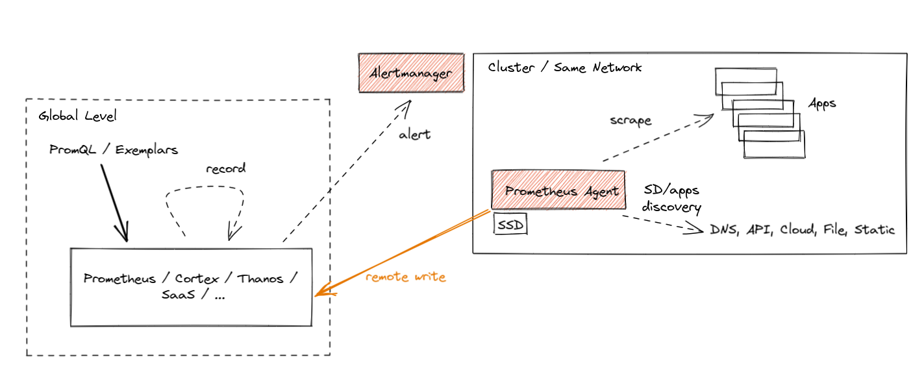

## Prometheus Agent Mode

The Prometheus Agent is an operational mode built into the Prometheus binary with the same scraping APIs, semantics, configuration, and discovery mechanism; this agent mode disables some of Prometheus' usual features(TSDB, alerting, and rule evaluations) and optimizes the binary for scraping and remote writing to remote locations. 

The Prometheus Remote Write protocol forwards(streams) all or a subset of metrics collected by Prometheus to a remote location; you can configure Prometheus to forward some metrics (if you want, with all metadata and exemplars!) to one or more locations that support the Remote Write API. 

With Remote Write, Prometheus still uses a pull model to gather metrics from applications, which gives us an understanding of those different failure modes. After that, we batch samples and series and export, replicate (push) data to the Remote Write endpoints, limiting the number of monitoring unknowns that the central point has.
Streaming data from such a scraper enables Global View use cases by allowing you to store metrics data in a centralized location. This enables the separation of concerns, which is useful when different teams manage applications than the observability or monitoring pipelines. 

The Agent mode optimizes Prometheus for the remote write use case. It disables querying, alerting, and local storage and replaces it with a customized TSDB WAL. Everything else stays the same: scraping logic, service discovery, and related configuration. It can be used as a drop-in replacement for Prometheus if you want to just forward your data to a remote Prometheus server or any other Remote-Write-compliant project. 

In essence, it looks like this:


### Benefits of agent mode

- Improved efficiency. The customized Agent TSDB WAL removes the data immediately after successful writes. If it cannot reach the remote endpoint, it persists the data temporarily on the disk until the remote endpoint is back online. This is currently limited to a two-hour buffer only, similar to non-agent Prometheus. This means that there is no need to build chunks of data in memory or maintain a full index for querying purposes. Essentially the Agent mode uses a fraction of the resources that a normal Prometheus server would use in a similar situation.
- Agent mode enables easier [horizontal scalability for ingestion](https://prometheus.io/blog/2021/11/16/agent/#the-dream-auto-scalable-metric-ingestion).

### Downsides of agent mode

- No local queries. You can not query the local Prometheus instance.
- Recording rules are not possible. You can not pre-summarize data for sending to remote write. Rules must be done remotely.
- No alerting. All alerting must be done by the remote system.

### How to Use Agent Mode in Detail

If you show the help output of Prometheus (--help flag), you should see more or less the following:

```
usage: prometheus [<flags>]

The Prometheus monitoring server

Flags:
  -h, --help                     Show context-sensitive help (also try --help-long and --help-man).
      (... other flags)
      --storage.tsdb.path="data/"
                                 Base path for metrics storage. Use with server mode only.
      --storage.agent.path="data-agent/"
                                 Base path for metrics storage. Use with agent mode only.
      (... other flags)
      --[no-]agent               Run Prometheus in 'Agent mode'.
```

Use the `--agent` flag to run Prometheus in the Agent mode. The rest of the flags are either for both server and Agent or only for a specific mode. You can see which flag is for which mode by checking the last sentence of a flag's help string. "Use with server mode only" means it's only for server mode. If you don't see any mention like this, it means the flag is shared.

The Agent mode accepts the same scrape configuration with the same discovery options and remote write options. It also exposes a web UI on port 9095 with disabled query capabilities but shows build info, configuration, targets, and service discovery information as in a normal Prometheus server.
