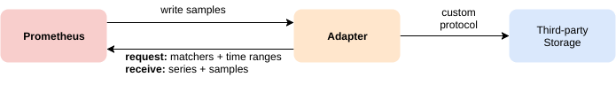

# Storage

Prometheus includes a local on-disk time series database, but also optionally integrates with remote storage systems.

## Local storage

Prometheus's local time series database stores data in a custom, highly efficient format on local storage.

### On-disk layout

Ingested samples are grouped into blocks of two hours. Each two-hour block consists
of a directory containing a chunks subdirectory containing all the time series samples
for that window of time, a metadata file, and an index file (which indexes metric names
and labels to time series in the chunks directory). The samples in the chunks directory
are grouped together into one or more segment files of up to 512MB each by default. When
series are deleted via the API, deletion records are stored in separate tombstone files
(instead of deleting the data immediately from the chunk segments).

The current block for incoming samples is kept in memory and is not fully
persisted. It is secured against crashes by a write-ahead log (WAL) that can be
replayed when the Prometheus server restarts. Write-ahead log files are stored
in the `wal` directory in 128MB segments. These files contain raw data that
has not yet been compacted; thus they are significantly larger than regular block
files. Prometheus will retain a minimum of three write-ahead log files.
High-traffic servers may retain more than three WAL files in order to keep at
least two hours of raw data.

A Prometheus server's data directory looks something like this:

```
./data
├── 01BKGV7JBM69T2G1BGBGM6KB12
│   └── meta.json
├── 01BKGTZQ1SYQJTR4PB43C8PD98
│   ├── chunks
│   │   └── 000001
│   ├── tombstones
│   ├── index
│   └── meta.json
├── 01BKGTZQ1HHWHV8FBJXW1Y3W0K
│   └── meta.json
├── 01BKGV7JC0RY8A6MACW02A2PJD
│   ├── chunks
│   │   └── 000001
│   ├── tombstones
│   ├── index
│   └── meta.json
├── chunks_head
│   └── 000001
└── wal
    ├── 000000002
    └── checkpoint.00000001
        └── 00000000
```

Note that a limitation of local storage is that it is not clustered or
replicated. Thus, it is not arbitrarily scalable or durable in the face of
drive or node outages and should be managed like any other single node
database. The use of RAID is suggested for storage availability, and
[snapshots](querying/api.md#snapshot) are recommended for backups. With proper
architecture, it is possible to retain years of data in local storage.

Alternatively, external storage may be used via the
[remote read/write APIs](https://prometheus.io/docs/operating/integrations/#remote-endpoints-and-storage).
Careful evaluation is required for these systems as they vary greatly in durability,
performance, and efficiency.

For further details on file format, see [TSDB format](/tsdb/docs/format/README.md).

## Compaction

The initial two-hour blocks are eventually compacted into longer blocks in the background.

Compaction will create larger blocks containing data spanning up to 10% of the retention time,
or 31 days, whichever is smaller.

## Operational aspects

Prometheus has several flags that configure local storage. The most important are:

- `--storage.tsdb.path`: Where Prometheus writes its database. Defaults to `data/`.
- `--storage.tsdb.retention.time`: When to remove old data. Defaults to `15d`.
  Overrides `storage.tsdb.retention` if this flag is set to anything other than default.
- `--storage.tsdb.retention.size`: The maximum number of bytes of storage blocks to retain.
  The oldest data will be removed first. Defaults to `0` or disabled. Units supported:
  B, KB, MB, GB, TB, PB, EB. Ex: "512MB". Based on powers-of-2, so 1KB is 1024B. Only
  the persistent blocks are deleted to honor this retention although WAL and m-mapped
  chunks are counted in the total size. So the minimum requirement for the disk is the
  peak space taken by the `wal` (the WAL and Checkpoint) and `chunks_head`
  (m-mapped Head chunks) directory combined (peaks every 2 hours).
- `--storage.tsdb.retention`: Deprecated in favor of `storage.tsdb.retention.time`.
- `--storage.tsdb.wal-compression`: Enables compression of the write-ahead log (WAL).
  Depending on your data, you can expect the WAL size to be halved with little extra
  cpu load. This flag was introduced in 2.11.0 and enabled by default in 2.20.0.
  Note that once enabled, downgrading Prometheus to a version below 2.11.0 will
  require deleting the WAL.

Prometheus stores an average of only 1-2 bytes per sample. Thus, to plan the
capacity of a Prometheus server, you can use the rough formula:

```
needed_disk_space = retention_time_seconds * ingested_samples_per_second * bytes_per_sample
```

To lower the rate of ingested samples, you can either reduce the number of
time series you scrape (fewer targets or fewer series per target), or you
can increase the scrape interval. However, reducing the number of series is
likely more effective, due to compression of samples within a series.

If your local storage becomes corrupted for whatever reason, the best
strategy to address the problem is to shut down Prometheus then remove the
entire storage directory. You can also try removing individual block directories,
or the WAL directory to resolve the problem. Note that this means losing
approximately two hours data per block directory. Again, Prometheus's local
storage is not intended to be durable long-term storage; external solutions
offer extended retention and data durability.

CAUTION: Non-POSIX compliant filesystems are not supported for Prometheus'
local storage as unrecoverable corruptions may happen. NFS filesystems
(including AWS's EFS) are not supported. NFS could be POSIX-compliant,
but most implementations are not. It is strongly recommended to use a
local filesystem for reliability.

If both time and size retention policies are specified, whichever triggers first
will be used.

Expired block cleanup happens in the background. It may take up to two hours
to remove expired blocks. Blocks must be fully expired before they are removed.

## Remote storage integrations

Prometheus's local storage is limited to a single node's scalability and durability.
Instead of trying to solve clustered storage in Prometheus itself, Prometheus offers
a set of interfaces that allow integrating with remote storage systems.

### Overview

Prometheus integrates with remote storage systems in three ways:

- Prometheus can write samples that it ingests to a remote URL in a standardized format.
- Prometheus can receive samples from other Prometheus servers in a standardized format.
- Prometheus can read (back) sample data from a remote URL in a standardized format.



The read and write protocols both use a snappy-compressed protocol buffer encoding over
HTTP. The protocols are not considered as stable APIs yet and may change to use gRPC
over HTTP/2 in the future, when all hops between Prometheus and the remote storage can
safely be assumed to support HTTP/2.

For details on configuring remote storage integrations in Prometheus, see the
[remote write](configuration/configuration.md#remote_write) and
[remote read](configuration/configuration.md#remote_read) sections of the Prometheus
configuration documentation.

The built-in remote write receiver can be enabled by setting the
`--web.enable-remote-write-receiver` command line flag. When enabled,
the remote write receiver endpoint is `/api/v1/write`.

For details on the request and response messages, see the
[remote storage protocol buffer definitions](https://github.com/prometheus/prometheus/blob/main/prompb/remote.proto).

Note that on the read path, Prometheus only fetches raw series data for a set of
label selectors and time ranges from the remote end. All PromQL evaluation on the
raw data still happens in Prometheus itself. This means that remote read queries
have some scalability limit, since all necessary data needs to be loaded into the
querying Prometheus server first and then processed there. However, supporting
fully distributed evaluation of PromQL was deemed infeasible for the time being.

### Existing integrations

To learn more about existing integrations with remote storage systems, see the
[Integrations documentation](https://prometheus.io/docs/operating/integrations/#remote-endpoints-and-storage).

## Backfilling from OpenMetrics format

### Overview

If a user wants to create blocks into the TSDB from data that is in
[OpenMetrics](https://openmetrics.io/) format, they can do so using backfilling.
However, they should be careful and note that it is not safe to backfill data
from the last 3 hours (the current head block) as this time range may overlap
with the current head block Prometheus is still mutating. Backfilling will
create new TSDB blocks, each containing two hours of metrics data. This limits
the memory requirements of block creation. Compacting the two hour blocks into
larger blocks is later done by the Prometheus server itself.

A typical use case is to migrate metrics data from a different monitoring system
or time-series database to Prometheus. To do so, the user must first convert the
source data into [OpenMetrics](https://openmetrics.io/) format, which is the
input format for the backfilling as described below.

### Usage

Backfilling can be used via the Promtool command line. Promtool will write the blocks
to a directory. By default this output directory is ./data/, you can change it by
using the name of the desired output directory as an optional argument in the sub-command.

```
promtool tsdb create-blocks-from openmetrics <input file> [<output directory>]
```

After the creation of the blocks, move it to the data directory of Prometheus.
If there is an overlap with the existing blocks in Prometheus, the flag
`--storage.tsdb.allow-overlapping-blocks` needs to be set for Prometheus versions
v2.38 and below. Note that any backfilled data is subject to the retention
configured for your Prometheus server (by time or size).

#### Longer Block Durations

By default, the promtool will use the default block duration (2h) for the blocks;
this behavior is the most generally applicable and correct. However, when backfilling
data over a long range of times, it may be advantageous to use a larger value for
the block duration to backfill faster and prevent additional compactions by TSDB later.

The `--max-block-duration` flag allows the user to configure a maximum duration of blocks.
The backfilling tool will pick a suitable block duration no larger than this.

While larger blocks may improve the performance of backfilling large datasets,
drawbacks exist as well. Time-based retention policies must keep the entire block
around if even one sample of the (potentially large) block is still within the
retention policy. Conversely, size-based retention policies will remove the entire
block even if the TSDB only goes over the size limit in a minor way.

Therefore, backfilling with few blocks, thereby choosing a larger block duration,
must be done with care and is not recommended for any production instances.

## Backfilling for Recording Rules

### Overview

When a new recording rule is created, there is no historical data for it.
Recording rule data only exists from the creation time on.
`promtool` makes it possible to create historical recording rule data.

### Usage

To see all options, use: `$ promtool tsdb create-blocks-from rules --help`.

Example usage:

```
$ promtool tsdb create-blocks-from rules \
    --start 1617079873 \
    --end 1617097873 \
    --url http://mypromserver.com:9090 \
    rules.yaml rules2.yaml
```

The recording rule files provided should be a normal
[Prometheus rules file](https://prometheus.io/docs/prometheus/latest/configuration/recording_rules/).

The output of `promtool tsdb create-blocks-from rules` command is a directory that
contains blocks with the historical rule data for all rules in the recording rule
files. By default, the output directory is `data/`. In order to make use of this
new block data, the blocks must be moved to a running Prometheus instance data dir
`storage.tsdb.path` (for Prometheus versions v2.38 and below, the flag
`--storage.tsdb.allow-overlapping-blocks` must be enabled). Once moved, the new
blocks will merge with existing blocks when the next compaction runs.

### Limitations

- If you run the rule backfiller multiple times with the overlapping start/end times,
  blocks containing the same data will be created each time the rule backfiller is run.
- All rules in the recording rule files will be evaluated.
- If the `interval` is set in the recording rule file that will take priority over
  the `eval-interval` flag in the rule backfill command.
- Alerts are currently ignored if they are in the recording rule file.
- Rules in the same group cannot see the results of previous rules. Meaning that rules
  that refer to other rules being backfilled is not supported. A workaround is to
  backfill multiple times and create the dependent data first (and move dependent
  data to the Prometheus server data dir so that it is accessible from the Prometheus API).
