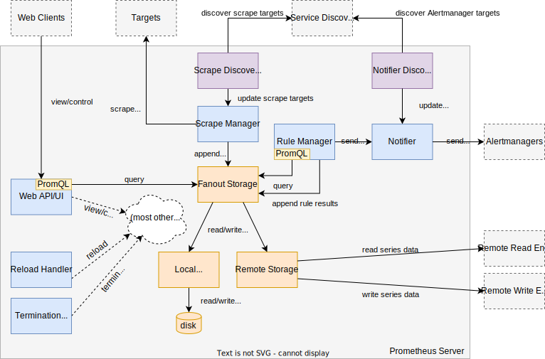

# Internal architecture

The Prometheus server consists of many internal components that work together in concert to achieve Prometheus's overall functionality. This document provides an overview of the major components, including how they fit together and pointers to implementation details. If you are a developer who is new to Prometheus and wants to get an overview of all its pieces, start here.

The overall Prometheus server architecture is shown in this diagram:

**NOTE**: Arrows indicate request or connection initiation direction, not necessarily dataflow direction.

The sections below will explain each component in the diagram. Code links and explanations are based on Prometheus version 2.3.1. Future Prometheus versions may differ.

## Main function

The [`main()` function](https://github.com/prometheus/prometheus/blob/v2.3.1/cmd/prometheus/main.go#L77-L600) initializes and runs all other Prometheus server components. It also connects interdependent components to each other.

As a first step, `main()` defines and parses the server's command-line flags into a [local configuration structure](https://github.com/prometheus/prometheus/blob/v2.3.1/cmd/prometheus/main.go#L83-L100), while performing extra sanitization and initialization for some values. Note that this flag-based configuration structure is independent of the configuration that is later read from a configuration file (as provided by the `--config.file` flag). Prometheus distinguishes between flag-based configuration and file-based configuration: flags are used for simple settings that do not support being updated without a server restart, while any settings provided in the configuration file have to support being reloaded without restarting the entire server.

Next, `main()` instantiates all the major run-time components of Prometheus and connects them together using channels, references, or passing in contexts for later coordination and cancellation. These components include service discovery, target scraping, storage, and more (as laid out in the rest of this document).

Finally, the server [runs all components](https://github.com/prometheus/prometheus/blob/v2.3.1/cmd/prometheus/main.go#L366-L598) in an [actor-like model](https://www.brianstorti.com/the-actor-model/), using [`github.com/oklog/oklog/pkg/group`](https://godoc.org/github.com/oklog/run) to coordinate the startup and shutdown of all interconnected actors. Multiple channels are used to enforce ordering constraints, such as not enabling the web interface before the storage is ready and the initial configuration file load has happened.

## Configuration

The configuration subsystem is responsible for reading, validating, and applying the settings provided in the YAML-based configuration file as specified by the `--config.file` flag. [See the documentation](https://prometheus.io/docs/prometheus/latest/configuration/configuration/) for a description of all configuration settings. Prometheus has functionality for reading and applying a configuration file, and it has a goroutine that watches for requests to reload the configuration from the same file. Both mechanisms are outlined below.

### Configuration reading and parsing

When the initial configuration is loaded or a subsequent reload happens, Prometheus calls the [`config.LoadFile()`](https://github.com/prometheus/prometheus/blob/v2.3.1/config/config.go#L52-L64) function to read its configuration from a file and parse it into the [`config.Config` structure](https://github.com/prometheus/prometheus/blob/v2.3.1/config/config.go#L133-L145). This structure represents the overall configuration of the server and all of its components. It contains sub-structures that mirror the hierarchy of the configuration file. Each struct has a [default configuration](https://github.com/prometheus/prometheus/blob/v2.3.1/config/config.go#L66-L131) as well as an `UnmarshalYAML()` method which parses the struct from YAML and may apply further validity checks or initializations. Once the configuration has been fully parsed and validated, the resulting configuration structure is returned.

### Reload handler

The [configuration reload handler](https://github.com/prometheus/prometheus/blob/v2.3.1/cmd/prometheus/main.go#L443-L478) is a goroutine that is implemented directly in `main()` and listens for configuration reload requests from either the web interface or a [`HUP` signal](https://en.wikipedia.org/wiki/Signal_(IPC)#SIGHUP). When it receives a reload request, it re-reads the configuration file from disk using `config.LoadFile()` as described above and applies the resulting `config.Config` structure to all components that support reloading by either [calling their `ApplyConfig()` method or by calling a custom reload function](https://github.com/prometheus/prometheus/blob/v2.3.1/cmd/prometheus/main.go#L302-L341).

## Termination handler

The [termination handler](https://github.com/prometheus/prometheus/blob/v2.3.1/cmd/prometheus/main.go#L367-L392) is a goroutine that is implemented directly in `main()` and listens for termination requests from either the web interface or a [`TERM` signal](https://en.wikipedia.org/wiki/Signal_(IPC)#SIGTERM). When it receives a termination request, it returns and thus triggers the orderly shutdown of all other Prometheus components via the actor coordination functionality provided by [`github.com/oklog/oklog/pkg/group`](https://godoc.org/github.com/oklog/run).

## Scrape discovery manager

The scrape discovery manager is a [`discovery.Manager`](https://github.com/prometheus/prometheus/blob/v2.3.1/discovery/manager.go#L73-L89) that uses Prometheus's service discovery functionality to find and continuously update the list of targets from which Prometheus should scrape metrics. It runs independently of the scrape manager (which performs the actual target scrapes) and feeds it with a stream of [target group](https://github.com/prometheus/prometheus/blob/v2.3.1/discovery/targetgroup/targetgroup.go#L24-L33) updates over a [synchronization channel](https://github.com/prometheus/prometheus/blob/v2.3.1/cmd/prometheus/main.go#L431).

Internally, the scrape discovery manager runs an instance of each configuration-defined service discovery mechanism in its own goroutine. For example, if a `scrape_config` in the configuration file defines two [`kubernetes_sd_config` sections](https://prometheus.io/docs/prometheus/latest/configuration/configuration/#%3Ckubernetes_sd_config%3E), the manager will run two separate [`kubernetes.Discovery`](https://github.com/prometheus/prometheus/blob/v2.3.1/discovery/kubernetes/kubernetes.go#L150-L159) instances. Each of these discovery instances implements the [`discovery.Discoverer` interface](https://github.com/prometheus/prometheus/blob/v2.3.1/discovery/manager.go#L41-L55) and sends target updates over a synchronization channel to the controlling discovery manager, which then enriches the target group update with information about the specific discovery instance and forwards it to the scrape manager.

When a configuration change is applied, the discovery manager stops all currently running discovery mechanisms and restarts new ones as defined in the new configuration file.

For more details, see the more extensive [documentation about service discovery internals](https://github.com/prometheus/prometheus/blob/master/discovery/README.md).

## Scrape manager

The scrape manager is a [`scrape.Manager`](https://github.com/prometheus/prometheus/blob/v2.3.1/scrape/manager.go#L47-L62) that is responsible for scraping metrics from discovered monitoring targets and forwarding the resulting samples to the storage subsystem.

### Target updates and overall architecture

In the same way that the scrape discovery manager runs one discovery mechanism for each `scrape_config`, the scrape manager runs a corresponding scrape pool for each such section. Both identify these sections (e.g. across reloads and across the two components) via the section's `job_name` field, which has to be unique in a given configuration file. The discovery manager sends target updates for each `scrape_config` over a synchronization channel to the scrape manager, [which then applies those updates to the corresponding scrape pools](https://github.com/prometheus/prometheus/blob/v2.3.1/scrape/manager.go#L150-L173). Each scrape pool in turn runs one scrape loop for each target. The overall hierarchy looks like this:

* Scrape manager
  * Scrape pool for `scrape_config` 1
    * Scrape loop for target 1
    * Scrape loop for target 2
    * Scrape loop for target 3
    * [...]
    * Scrape loop for target n
  * Scrape pool for `scrape_config` 2
    * [...]
  * Scrape pool for `scrape_config` 3
    * [...]
  * [...]
  * Scrape pool for `scrape_config` n
    * [...]

### Target labels and target relabeling

Whenever the scrape manager receives an updated list of targets for a given scrape pool from the discovery manager, the scrape pool applies default target labels (such as `job` and `instance`) to each target and applies [target relabeling configurations](https://prometheus.io/docs/prometheus/latest/configuration/configuration/#%3Crelabel_config%3E) to produce the final list of targets to be scraped.

### Target hashing and scrape timing

To spread out scrapes within a scrape pool and in a consistently slotted way across the `scrape_config`'s scrape interval, each target is [hashed by its label set and its final scrape URL](https://github.com/prometheus/prometheus/blob/v2.3.1/scrape/target.go#L75-L82). This hash is then used to [choose a deterministic offset](https://github.com/prometheus/prometheus/blob/v2.3.1/scrape/target.go#L84-L98) within that interval.

### Target scrapes

Finally, a scrape loop periodically scrapes its targets over HTTP and tries to decode the received HTTP responses according to the [Prometheus text-based metrics exposition format](https://prometheus.io/docs/instrumenting/exposition_formats/). It then applies [metric relabeling configurations](https://prometheus.io/docs/prometheus/latest/configuration/configuration/#%3Cmetric_relabel_configs%3E) to each individual sample and sends the resulting samples to the storage subsystem. Additionally, it tracks and stores the staleness of time series over multiple scrape runs, records [scrape health information](https://prometheus.io/docs/concepts/jobs_instances/#automatically-generated-labels-and-time-series) (such as the `up` and `scrape_duration_seconds` metrics), and performs other housekeeping tasks to optimize the appending of time series to the storage engine. Note that a scrape is not allowed to take longer than the configured scrape interval, and the configurable scrape timeout is capped to that. This ensures that one scrape is terminated before another one begins.

## Storage

Prometheus stores time series samples in a local time series database (TSDB) and optionally also forwards a copy of all samples to a set of configurable remote endpoints. Similarly, Prometheus reads data from the local TSDB and optionally also from remote endpoints. Both local and remote storage subsystems are explained below.

### Fanout storage

The [fanout storage](https://github.com/prometheus/prometheus/blob/v2.3.1/storage/fanout.go#L27-L32) is a [`storage.Storage`](https://github.com/prometheus/prometheus/blob/v2.3.1/storage/interface.go#L31-L44) implementation that proxies and abstracts away the details of the underlying local and remote storage subsystems for use by other components. For reads, it merges query results from local and remote sources, while writes are duplicated to all local and remote destinations. Internally, the fanout storage differentiates between a primary (local) storage and optional secondary (remote) storages, as they have different capabilities for optimized series ingestion.

Currently rules still read and write directly from/to the fanout storage, but this will be changed soon so that rules will only read local data by default. This is to increase the reliability of alerting and recording rules, which should only need short-term data in most cases.

### Local storage

Prometheus's local on-disk time series database is a [light-weight wrapper](https://github.com/prometheus/prometheus/blob/v2.3.1/storage/tsdb/tsdb.go#L102-L106) around [`github.com/prometheus/tsdb.DB`](https://github.com/prometheus/tsdb/blob/master/db.go#L92-L117). The wrapper makes only minor interface adjustments for use of the TSDB in the context of the Prometheus server and implements the [`storage.Storage` interface](https://github.com/prometheus/prometheus/blob/v2.3.1/storage/interface.go#L31-L44). You can find more details about the TSDB's on-disk layout in the [local storage documentation](https://prometheus.io/docs/prometheus/latest/storage/).

### Remote storage

The remote storage is a [`remote.Storage`](https://github.com/prometheus/prometheus/blob/v2.3.1/storage/remote/storage.go#L31-L44) that implements the [`storage.Storage` interface](https://github.com/prometheus/prometheus/blob/v2.3.1/storage/interface.go#L31-L44) and is responsible for interfacing with remote read and write endpoints.

For each [`remote_write`](https://prometheus.io/docs/prometheus/latest/configuration/configuration/#%3Cremote_write%3E) section in the configuration file, the remote storage creates and runs one [`remote.QueueManager`](https://github.com/prometheus/prometheus/blob/v2.3.1/storage/remote/queue_manager.go#L141-L161), which in turn queues and sends samples to a specific remote write endpoint. Each queue manager parallelizes writes to the remote endpoint by running a dynamic number of shards based on current and past load observations. When a configuration reload is applied, all remote storage queues are shut down and new ones are created.

For each [`remote_read`](https://prometheus.io/docs/prometheus/latest/configuration/configuration/#%3Cremote_read%3E) section in the configuration file, the remote storage creates a [reader client](https://github.com/prometheus/prometheus/blob/v2.3.1/storage/remote/storage.go#L96-L118) and results from each remote source are merged.

## PromQL engine

The [PromQL engine](https://github.com/prometheus/prometheus/blob/v2.3.1/promql/engine.go#L164-L171) is responsible for evaluating [PromQL expression queries](https://prometheus.io/docs/prometheus/latest/querying/basics/) against Prometheus's time series database. The engine does not run as its own actor goroutine, but is used as a library from the web interface and the rule manager. PromQL evaluation happens in multiple phases: when a query is created, its expression is parsed into an abstract syntax tree and results in an executable query. The subsequent execution phase first looks up and creates iterators for the necessary time series from the underlying storage. It then evaluates the PromQL expression on the iterators. Actual time series bulk data retrieval happens lazily during evaluation (at least in the case of the local TSDB). Expression evaluation returns a PromQL expression type, which most commonly is an instant vector or range vector of time series.

## Rule manager

The rule manager is a [`rules.Manager`](https://github.com/prometheus/prometheus/blob/v2.3.1/rules/manager.go#L410-L418) that is responsible for evaluating recording and alerting rules on a periodic basis (as configured using the `evaluation_interval` configuration file setting). It evaluates all rules on every iteration using PromQL and writes the resulting time series back into the storage.

For alerting rules, the rule manager performs several actions on every iteration:

- It stores the series `ALERTS{alertname="<alertname>", <alert labels>}` for any pending or firing alerts.
- It tracks the lifecycle state of active alerts to decide when to transition an alert from pending to firing (depending on the `for` duration in the alerting rule).
- It expands the label and annotation templates from the alerting rule for each active alert.
- It sends firing alerts to the notifier (see below) and keeps sending resolved alerts for 15 minutes.

## Notifier

The notifier is a [`notifier.Manager`](https://github.com/prometheus/prometheus/blob/v2.3.1/notifier/notifier.go#L104-L119) that takes alerts generated by the rule manager via its `Send()` method, enqueues them, and forwards them to all configured Alertmanager instances. The notifier serves to decouple generation of alerts from dispatching them to Alertmanager (which may fail or take time).

## Notifier discovery

The notifier discovery manager is a [`discovery.Manager`](https://github.com/prometheus/prometheus/blob/v2.3.1/discovery/manager.go#L73-L89) that uses Prometheus's service discovery functionality to find and continuously update the list of Alertmanager instances that the notifier should send alerts to. It runs independently of the notifier manager and feeds it with a stream of target group updates over a [synchronization channel](https://github.com/prometheus/prometheus/blob/v2.3.1/cmd/prometheus/main.go#L587).

Internally it works like the scrape discovery manager.

## Web UI and API

Prometheus serves its web UI and API on port `9090` by default. The web UI is available at `/` and serves a human-usable interface for running expression queries, inspecting active alerts, or getting other insight into the status of the Prometheus server.

The web API is served under `/api/v1` and allows programmatical [querying, metadata, and server status inspection](https://prometheus.io/docs/prometheus/latest/querying/api/).

[Console templates](https://prometheus.io/docs/visualization/consoles/), which allow Prometheus to serve user-defined HTML templates that have access to TSDB data, are served under `/consoles` when console templates are present and configured.
