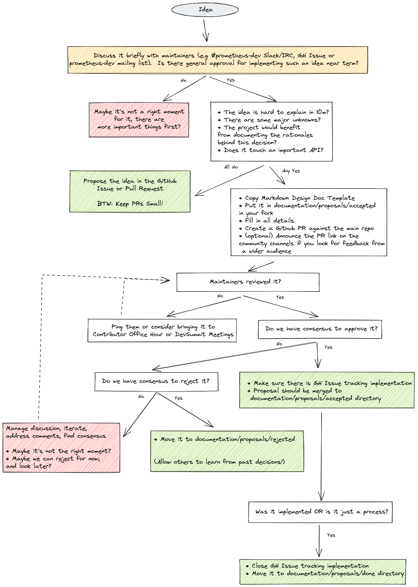

# Proposals Process

If there is no problem, there is no need for changing anything, no need for a proposal. This might feel trivial, but we should first ask ourselves this question before even thinking about writing a proposal.

It takes time to propose an idea, find consensus and implement more significant concepts, so let's not use the time before we feel it's worth it. Even good ideas sometimes have to wait for a good moment to discuss them.

Let's assume the idea sounds interesting to you. Yet, some ideas are quick and trivial enough to not require a formal proposal. To learn if we need proposal, ask yourself a following questions:

* Is the idea hard to explain in 10m?
* Are there major unknowns?
* Would the project benefit from documenting the rationales behind this decision?
* Does it touch the key element of an important API?

If any of this is yes, this idea might require a formal proposal. See full proposal process, visualised below:

> Note: It's totally ok for your proposal to be rejected if the community feels the idea is not needed now or having gaps. Not all ideas are as good as it looks at the first glance, with less context. Sometimes it's not a good time for it either. It's better to explicitly oppose it than to ignore it and leave it in limbo.

## Why do we have a Proposal Process?

See rationales in our [proposal for proposal process](./done/202106-proposals-process.md)

## Template:

## Your Proposal Title

* **Owners:**
  * `<@author: single champion for the moment of writing>`

* **Related Tickets:**
  * `<JIRA, GH Issues>`

* **Other docs:**
  * `<Links…>`

> TL;DR: Give a summary of what this document is proposing and what components it is touching.
>
> *For example: This design doc is proposing a consistent design template for “example.com” organization.*

## Why

Provide a motivation behind the change proposed by this design document, give context.

*For example: It’s important to clearly explain the reasons behind certain design decisions in order to have a consensus between team members, as well as external stakeholders. Such a design document can also be used as a reference and knowledge-sharing purposes. That’s why we are proposing a consistent style of the design document that will be used for future designs.*

### Pitfalls of the current solution

What specific problems are we hitting with the current solution? Why it’s not enough?

*For example, We were missing a consistent design doc template, so each team/person was creating their own. Because of inconsistencies, those documents were harder to understand, and it was easy to miss important sections. This was causing certain engineering time to be wasted.*

## Goals

Goals and use cases for the solution as proposed in [How](#how):

* Allow easy collaboration and decision making on design ideas.
* Have a consistent design style that is readable and understandable.
* Have a design style that is concise and covers all the essential information.

### Audience

If this is not clear already, provide the target audience for this change.

## Non-Goals

* Move old designs to the new format.
* Not doing X,Y,Z.

## How

Explain the full overview of the proposed solution. Some guidelines:

* Make it concise and **simple**; put diagrams; be concrete, avoid using “really”, “amazing” and “great” (:
* How you will test and verify?
* How you will migrate users, without downtime. How we solve incompatibilities?
* What open questions are left? (“Known unknowns”)

## Alternatives

The section stating potential alternatives. Highlight the objections reader should have towards your proposal as they read it. Tell them why you still think you should take this path [[ref](https://twitter.com/whereistanya/status/1353853753439490049)]

1. This is why not solution Z...

## Action Plan

The tasks to do in order to migrate to the new idea.

* [ ] Task one <gh issue="">

* [ ] Task two <gh issue=""> ...
