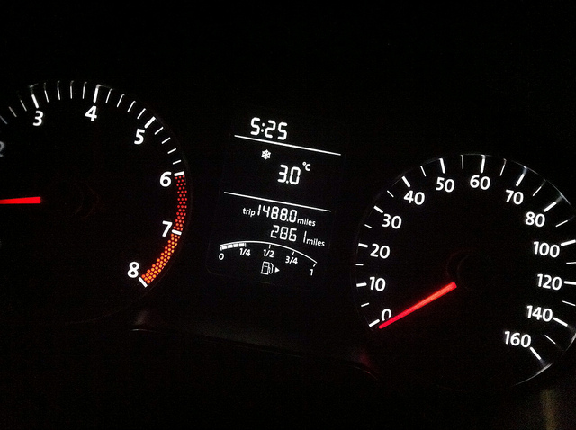

# Introduction

Prometheus is in the business of doing several things:

  * exposing metrics,
  * collecting metrics,
  * performing computational rules upon them and generating synthetic series,
  * triggering events based upon rule conditions, and
  * metric series archival and deletion.

The focus of this guide is oriented exclusively toward exposing metrics with
an eye toward computational rules and event handling in the Prometheus core.

After reading this guide, you will understand the following:

  * what types of Prometheus metrics are available and how they work,
  * how you should embed these metrics in your applications,
  * what metadata you attach to them, and
  * what to instrument.

# Metric Types

Prometheus offers three core metric types:

  * counters,
  * gauges, and
  * summaries.

Each is tailored toward a different purpose, so it is important to use the
right one for the right job.

## Counter

A _Counter_ tracks addition or subtraction of values from itself.  It is used
to represent state that you control and is not external.

The following are good examples or applications of counters:

  * pedometers: devices that track the number of steps you take,
  * tickers: devices that measure the number of times an event has occurred,
  * censuses: processes to count to number of individuals of a population, and
  * _your_ bank account ledger: the sum of all transactions conducted on your
    liquid assets.

The key thing to note about _Counters_ is that they are best used when you are
directly receiving the events that mutate their values and mutating the
underlying values that represent their individual state.

A good example is of an elevator that tracks how many times it has been used in
its duty cycle.  Each time someone hits the button to dispatch it, the elevator
can update its tally; and this is a tally it keeps!

See also the [counter implementation](https://github.com/prometheus/client_java/blob/master/client/src/main/java/io/prometheus/client/metrics/Counter.java)
in Prometheus' Java client library for further documentation and concrete code
examples.

## Gauges

A _Gauge_ reports instantaneous values based on external state.  This is
primarily state that you do not control directly but rather that you depend on
or can inspect.

The following are good examples or applications of gauges:

  * thermometer,
  * barometer,
  * altimeter, and
  * total system resource utilization.

Unlike a _Counter_, you don't have direct access to the events that brought the
_Gauge_ to its value today.  This is a white-box and black-box distinction.

See also the [gauge implementation](https://github.com/prometheus/client_java/blob/master/client/src/main/java/io/prometheus/client/metrics/Gauge.java)
in Prometheus' Java client library for further documentation and concrete code
examples.

## Which to use: Counter or Gauge?
Knowing whether to use a _Counter_ or a _Gauge_ can be tough.  Let's perform a
practical thought exercise.  Below is an image of an automobile's instrument
dashboard:

What do you see in this photo?  Take a minute to make a list.  (Don't worry;
I'll wait for you.)

From left to right and top to bottom, there are the following instruments:

  * Tachometer: it measures the revolutions per minute of the engine;
  * Clock: it measures the time;
  * Thermometer: it measures the temperature outside the vehicle;
  * Odometer: they measure the total miles the vehicle has traveled as well as
    how far it has traveled on its last trip;
  * Fuel Gauge: it measures how much fuel is in the tank;
  * Speedometer: it measures how fast we are going.

Great!  Look at this list and now think about the definitions above for
_Counter_ and _Gauge_.  Can you identify what instruments are what?  (Again,
I'll wait for you.)

  * Tachometer: Counter.  Tricky.  The vehicle's sensors observe how quickly
    the flywheel rotates and update the instrument's value on frequent
    intervals by counting revolutions.
  * Clock: Gauge.  It is an external value, and we cannot watch the clock's
    internal events.
  * Thermometer: Gauge.  It measures an external value, and there is no way to
    track thermodynamic events that influence the outside temperature.
  * Odometer: Counter.  It measures distances by the number of times the
    wheels have turned, which itself is based on an event.
  * Fuel Gauge: Gauge.  Who would have guessed?  It uses a floating ballast and
    a rheostat and is not event-based.
  * Speedmeter: Counter.  Tricky.  It measures wheel rotation (events) over
    time.

## Summaries

_Summary_ is a unique metric type, and one you have probably not used before.
It samples events over sliding windows of time and provides instantaneous
insight into their distributions, frequencies, and sums.

Practically speaking, a summary collects event values and reports the
following information:

  * streaming quantile values of the entire observed population,
  * the total sum of all observed values, and
  * the count of events that have been observed.

This is quite convenient, for if you are interested in tracking latencies of an
operation in real time, you get three types of information reported for free
with one metric.

See also the [summary implementation](https://github.com/prometheus/client_java/blob/master/client/src/main/java/io/prometheus/client/metrics/Summary.java)
in Prometheus' Java client library for further documentation and concrete code
examples.

# Acknowledgements
Robert Bray: Vehicle Instrument Panel
